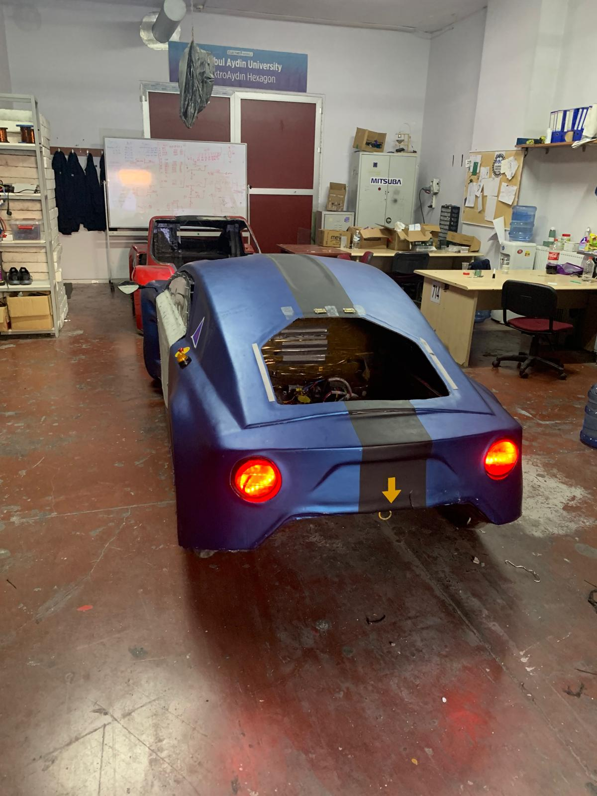

# Yarış Navigasyonu Sistemi

> Bu proje, elektronik sistem geliştirme, konum takibi ve gerçek zamanlı veri görselleştirme alanlarında uygulamalı mühendislik deneyimi kazanmak amacıyla hazırlanmıştır.

## Proje Özeti

Bu proje, yarış veya rota takibi senaryolarında aracın anlık konumunu önceden belirlenmiş rota üzerinde canlı olarak gösterebilmek amacıyla geliştirilmiştir. Sistem Raspberry Pi tabanlı olarak tasarlanmış, GPS modülünden alınan veriler GPX rota verisi ile eşleştirilmiş ve grafik arayüz üzerinde görselleştirilmiştir.

## Projenin Amacı

Bu projenin temel amacı, gerçek zamanlı konum takibi yapabilen, rota verisini yorumlayabilen ve kullanıcıya sade bir arayüz üzerinden anlık bilgi sunabilen işlevsel bir sistem geliştirmektir.

## Gerçekleştirilen Çalışmalar

- Raspberry Pi tabanlı sistem altyapısı oluşturuldu
- GPS modülünden canlı konum verisi alındı
- GPX formatındaki rota verisi sisteme entegre edildi
- Canlı konum ile rota eşleştirme mantığı geliştirildi
- Grafik arayüz üzerinde rota ve araç konumu görselleştirildi
- Gerçek zamanlı takip yapısı oluşturuldu

## Kullanılan Teknolojiler

- Raspberry Pi
- GPS modülü
- Python
- GPX rota verisi
- Grafik arayüz bileşenleri

## Teknik Kazanımlar

Bu proje kapsamında aşağıdaki alanlarda uygulamalı deneyim kazanılmıştır:

- Gömülü sistem geliştirme
- GPS veri işleme
- Rota eşleştirme mantığı
- Gerçek zamanlı veri görselleştirme
- Kullanıcı arayüzü geliştirme

## Proje Görselleri

- Hız ve yön bilgisinin eklenmesi
- Kalan mesafe bilgisinin gösterilmesi
- Daha gelişmiş harita altyapısı
- Dokunmatik ekran desteği
- Daha hassas konum düzeltme algoritmaları

## Sonuç

Bu proje, gerçek zamanlı konum takibi ve rota görselleştirmesi alanında işlevsel bir prototip ortaya koymaktadır. Aynı zamanda Raspberry Pi tabanlı sistem geliştirme ve yazılım-donanım entegrasyonu konusunda önemli bir uygulama çalışmasıdır.
